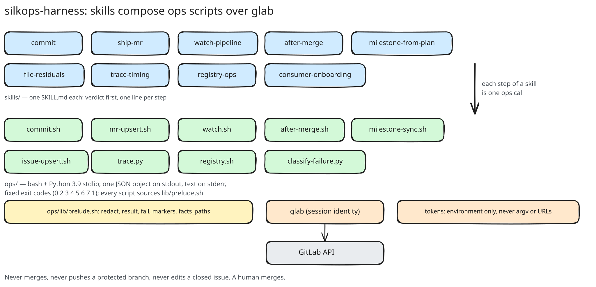
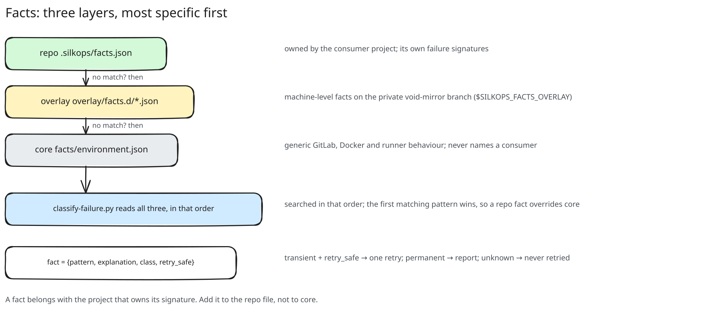
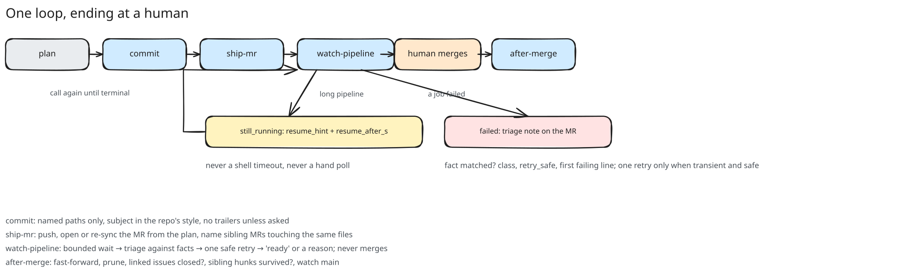

# silkops-harness

A GitLab dev-loop harness for coding agents: skills that compose small operations scripts over
`glab`, so a session ships a branch, watches its pipeline, triages a failure against recorded
facts, and files issues from a plan without hand-written API glue. It never merges; a human does.

## Install

Claude Code: `claude plugin marketplace add OpenZephyr/SilkOps`, then install `silkops-harness`;
or unpack the release asset `silkops-harness-X.Y.Z.tar.gz` from the GitHub Release. Needs `glab`, `jq`,
`curl`, Python 3.9. Tokens come from the environment only (`SILKOPS_CI_TOKEN`,
`SILKOPS_SETTINGS_TOKEN`); nothing is ever placed in argv or a URL.

## Skills

| skill | does |
|---|---|
| `commit` | commit named paths in the repo's own message style, no trailers unless asked |
| `ship-mr` | push the branch, open or re-sync its MR from the plan, hand off to the watch |
| `watch-pipeline` | bounded watch, fact-based triage, one safe retry, ready verdict, never merges |
| `after-merge` | sync and prune after a human merged, confirm linked issues, watch main |
| `milestone-from-plan` | one call turns a plan's units into a milestone with linked issues |
| `file-residuals` | review findings as issues, deduplicated by finding |
| `trace-timing` | where the time goes in a job, ranked with numbers |
| `registry-ops` | zero-copy retag, digest compare, tag listing |
| `consumer-onboarding` | connect a project to an image factory, one confirmation per settings write |

Skills call one entry command, `bin/silkops <verb>`, which runs the matching script from any
agent or CI; `silkops doctor` says what the machine has. Every script prints one JSON object on stdout, human text on stderr, fixed exit codes
(`AGENTS.md`). `SILKOPS_MARKER=off` makes every write anonymous for repos that must not name
the tool.

## Facts

A failure signature is a fact: a regex, an explanation, a retry verdict. Three layers, most
specific first: the repo's `.silkops/facts.json`, the plugin overlay, then
`facts/environment.json`. Core ships generic GitLab, Docker and runner facts only; a project's
own signatures travel with that project.

## Diagrams

Excalidraw scenes under `docs/diagrams/`: `architecture` (skills over ops over glab),
`fact-layers`, `ship-watch-loop`, `providers`. The `.excalidraw` file is the source; the `.excalidraw.svg`
beside it is the export with the scene embedded, so either is editable. Open with the Excalidraw
PWA offline, `docker run -p 5000:80 excalidraw/excalidraw`, or the VS Code Excalidraw extension;
export as SVG with "Embed scene" and save over the file.

## Hosts

GitLab is the source of truth and the first provider; GitHub runs behind the same verbs (pull
requests as MRs, workflow runs as pipelines, `runs[]` per commit); Gitea is fixture-verified and
flagged experimental. What each concept means on each host: `docs/providers.md`.

## Develop

`bash tests/run.sh` runs tier 1 (offline, fixture-driven; gates every change). `AGENTS.md`
holds the conventions; `CLAUDE.md` only imports it. Source of truth is GitLab; GitHub (`OpenZephyr/SilkOps`) is a
main-only mirror, and `ops/inbox.sh --repo OpenZephyr/SilkOps` lists what people file there.

Release: tag `silkops-harness--vX.Y.Z` on main (CI publishes the asset to GitLab), then
`scripts/github-release.sh --repo OpenZephyr/SilkOps --tag <tag>` creates the GitHub Release.
