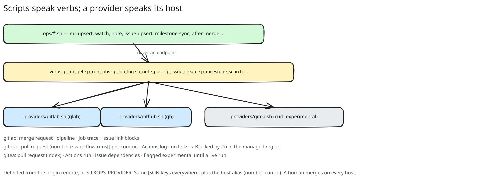

# SilkOps

A dev-loop harness for coding agents on GitLab, GitHub and Gitea. Skills compose small
operations scripts over the host's CLI, so a session commits, ships a branch, watches its
pipeline, triages a failure against recorded facts, and files issues from a plan, with no
hand-written API glue. It never merges. A human does.


## Install

**Claude Code**

```
/plugin marketplace add OpenZephyr/SilkOps
/plugin install silkops@silkops
```
then once, in a terminal, so the skills find the `silkops` command:
```
bash ~/.claude/plugins/cache/silkops/silkops/*/bin/silkops install-agent claude-code
```

**Codex, Cursor, OpenCode, Gemini CLI** (any agent that reads SKILL.md)

```
git clone https://github.com/OpenZephyr/SilkOps.git ~/.silkops
~/.silkops/bin/silkops install-agent all      # or one: codex | cursor | opencode | gemini-cli | claude-code
```

That links the nine skills where the agent looks, puts `silkops` in `~/.local/bin`, and writes the
conventions import the agent reads. Then `silkops doctor` shows what the machine has. Per-agent
notes: `adapters/<name>/README.md`. Requirements: `jq`, `curl`, Python 3.9, and the host CLI
(`glab` for GitLab, `gh` for GitHub, a `GITEA_TOKEN` for Gitea). Tokens come from the environment
only, never argv or a URL.

## One command, one JSON result

```
silkops watch --project group/project --mr 42 --wait 300
{"ok":true,"provider":"gitlab","status":"success","ready":true,"detailed_merge_status":"mergeable", …}
```

Every verb is one script under `ops/`: one JSON object on stdout, human text on stderr, fixed
exit codes (`AGENTS.md`). The provider is read off the origin remote or `SILKOPS_PROVIDER`.
`SILKOPS_MARKER=off` makes every write anonymous for repos that must not name the tool.

## Skills

| skill | does |
|---|---|
| `commit` | commit named paths in the repo's own message style, no trailers unless asked |
| `ship-mr` | push the branch, open or re-sync its MR from the plan, hand off to the watch |
| `watch-pipeline` | bounded watch, fact-based triage, one safe retry, a ready verdict, never merges |
| `after-merge` | sync and prune after a human merged, confirm linked issues, watch main |
| `milestone-from-plan` | one call turns a plan's units into a milestone with linked issues |
| `file-residuals` | review findings as issues, deduplicated by finding |
| `trace-timing` | where the time goes in a job, ranked with numbers |
| `registry-ops` | zero-copy retag, digest compare, tag listing |
| `consumer-onboarding` | connect a project to an image factory, one confirmation per settings write |

## Hosts

| | GitLab | GitHub | Gitea |
|---|---|---|---|
| change | merge request | pull request | pull request |
| CI unit | pipeline | workflow runs, `runs[]` per commit | Actions run |
| status | verified live | fixture-verified, live check open | fixture-verified, flagged `experimental` |

What every concept means on every host, and each fallback by name: `docs/providers.md`.

## Facts

A failure signature is a fact: a regex, an explanation, a retry verdict. Three layers, most
specific first: the repo's `.silkops/facts.json`, the plugin overlay, then `facts/environment.json`.
Core ships generic GitLab, Docker and runner facts only; a project's own signatures travel with it.


## Diagrams

Excalidraw scenes under `docs/diagrams/`. The `.excalidraw` file is the source and the
`.excalidraw.svg` beside it embeds the scene, so both are editable: open either in the Excalidraw
PWA, `docker run -p 5000:80 excalidraw/excalidraw`, or the VS Code extension, and export as SVG
with "Embed scene".




## Develop

- `bash tests/run.sh`: tier 1, offline and fixture-driven, gates every change.
- `AGENTS.md` holds the conventions; `CLAUDE.md` and `GEMINI.md` only import it.
- Source of truth is GitLab; GitHub (`OpenZephyr/SilkOps`) is a main-only mirror, and
  `silkops inbox --repo OpenZephyr/SilkOps` lists what people file there.
- Release: tag `silkops-harness--vX.Y.Z` on main (CI publishes the asset to GitLab), then
  `scripts/github-release.sh --repo OpenZephyr/SilkOps --tag <tag>` creates the GitHub Release.

MIT. Issues and pull requests are welcome on GitHub.
