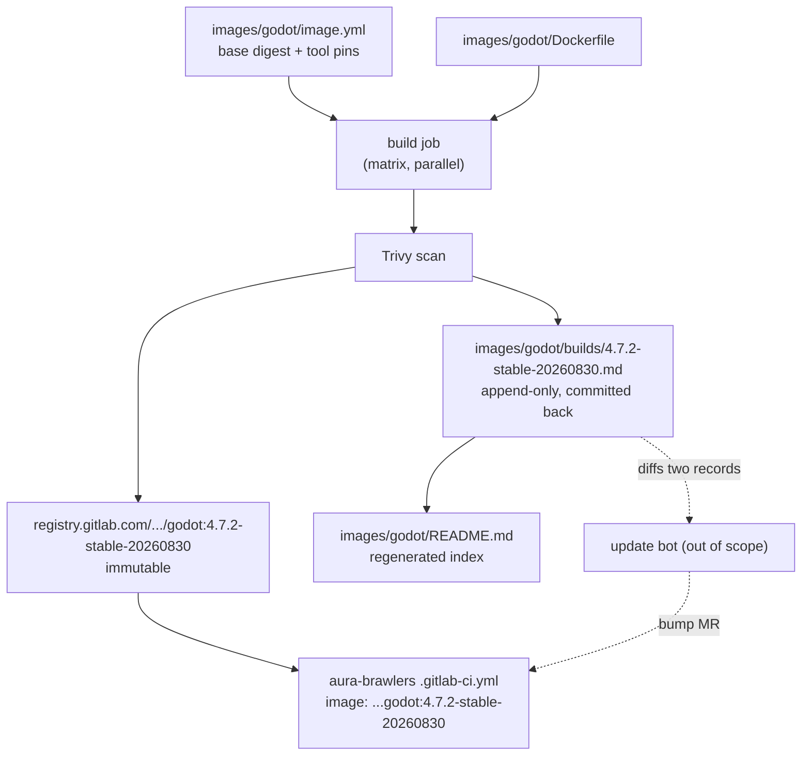
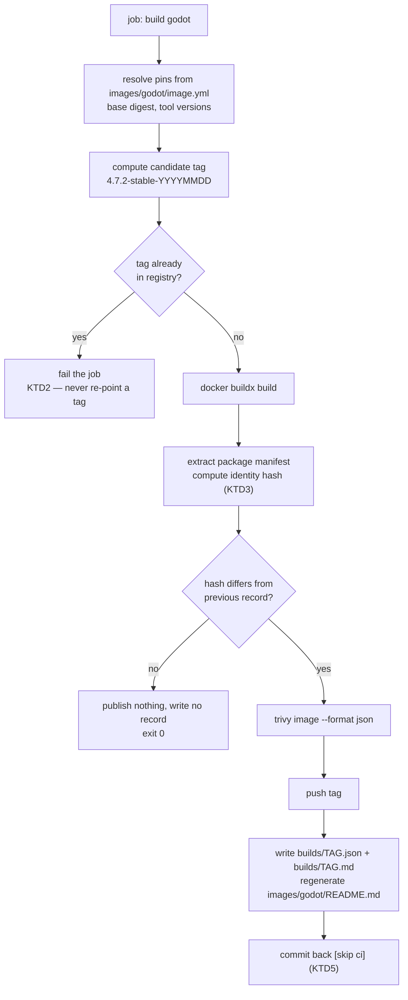

# CI Image Factory - Plan

## Goal Capsule

- **Objective:** Pipelines across the `void-realm-solutions` group get their toolchain pre-materialized instead of assembling it per job, and every image that ships carries a durable, per-tag record of exactly what was inside it.
- **Means:** `ci-cd` gains an `images/` catalog whose entries build, scan, and publish immutable-tagged images through explicit per-image jobs (KTD1) to `registry.gitlab.com/void-realm-solutions/ci-cd/*`.
- **Product authority:** This plan owns the image factory and its generated audit records. The update-surveillance bot, group-wide consumer migration, and the productization/wiki layer are separate work and are not active scope.
- **Execution profile:** Pipeline-verified rather than unit-tested. `ci-cd` has no test framework; correctness is proven by pipeline behavior against the Acceptance Examples, per the Verification Contract.
- **Stop conditions:** Stop and surface rather than guess if a publish would overwrite an existing tag, if the record commit-back would trigger a pipeline loop, or if the `aura-brawlers` measurement in U8 shows the factory slower than the 3243s baseline.
- **Tail ownership:** U8 spans a second repository (`aura-brawlers`). Land the `ci-cd` work and the `aura-brawlers` migration as separate MRs in their own repos.
- **Open blockers:** None.

---

## Product Contract

### Summary

Turn `ci-cd` from a collection of includable job templates into a container image factory: a flat `images/*` catalog where each entry declares its pins, builds in parallel, gets scanned, publishes under an immutable `<toolver>-<YYYYMMDD>` tag, and emits an append-only markdown record of that exact tag. Consumer repos pin the tag, so no environment ever changes under a repo without a reviewable commit.

### Problem Frame

Pipeline jobs in this group assemble their toolchain from the internet on every run, on `saas-linux-small-amd64` runners with 2 vCPU and slow ephemeral disk. The cost is not distributed evenly — it concentrates wherever a job has to materialize a large filesystem tree.

`aura-brawlers` `release-build-linux` is the extreme case. The job takes 3243 seconds. The Godot export it exists to perform takes 38 of them.

| Seconds | Step |
|---:|---|
| 1132 | `cp "${TPL_CACHE}"/* "$TPL_DIR/"` — copying restored export templates into place |
| 980 | Download and unpack `Godot_v4.7.2_export_templates.tpz` |
| 476 | `archive_cache` |
| 245 | `cleanup_file_variables` |
| 129 | `apt-get install wget unzip ca-certificates` |
| 52 | `godot --headless --import` |
| 38 | `godot --export-release "Linux"` |

Roughly 98% of that job is environment assembly. The Windows sibling job does not cache the templates at all and re-downloads the archive every run.

The same measurement rules out a uniform response. `j-teach` `build-apk-release` takes 816 seconds: 94s pulling `instrumentisto/flutter:3.41.6-androidsdk36-r0`, 1s for `flutter pub get` against a warm cache, and roughly 658s of genuine Gradle and AOT compilation. It is already on a prebuilt image and its remaining time is CPU, not filesystem.

Underneath the latency sits a second cost. Because environments are assembled at run time from floating upstream sources, nothing records what was actually inside a build. `tasks/terraform-scanners/.terraform-scan.yml` runs `tenable/terrascan:latest`, `aquasec/tfsec:latest`, and `bridgecrew/checkov:latest` — the security tooling itself is unpinned. `tasks/manual-sec-scan/.manual-sec-scan.yml` installs Trivy and `docker-ce` from upstream apt repositories inside the scanning job. There is no answer to "what was in the thing we shipped, and was any of it vulnerable."

`ci-cd` has had a container registry enabled and unused since its last activity in October 2024.

### Key Decisions

- KD1. **Wall-clock feedback latency is the success metric.** Optimize the critical path; spending more total compute to shorten the wait is an acceptable trade. (session-settled: user-directed — chosen over CI-minute quota, reproducibility, and audit posture as the primary driver: the wait itself is what hurts.) Governs R6, R9, R10.
- KD2. **Consumers pin immutable tags; a bot later raises bump MRs.** A tag, once published, is never rebuilt or re-pointed. (session-settled: user-directed — chosen over floating tags and digest pinning: a one-line reviewable diff that blames to a commit and reverts with `git revert`, at the cost of N MRs per bump.) Governs R7, R8, R16.
- KD3. **Audit records are append-only and per-tag, never rewritten in place.** (session-settled: user-directed — chosen over a current-state README: an immutable tag whose documentation is overwritten stops describing the tags still in use the moment a second one exists.) Governs R11, R12, R13.
- KD4. **Flat catalog over a layered base-and-overlay hierarchy.** Each image is one self-contained directory, matching the existing `tasks/` idiom. (session-settled: user-approved — chosen over layered bases: immutable tags make a base bump re-tag every descendant, and the resulting dependency chain serializes builds on the runners where parallelism is what buys back latency. Revisit past roughly fifteen images.) Governs R1, R5.
- KD5. **An image earns a catalog slot when its cost is filesystem materialization, not compute.** A Docker layer is already materialized in the runner's layer store; a package archive is not. (session-settled: user-approved — this is the rule that explains why Godot is transformative and Flutter is not, and it generalizes to future candidates.) Governs R2, R3, R4.
- KD6. **AI is not part of the image build.** Building a pinned image is deterministic and has no honest use for a model. OpenRouter belongs to the update bot's changelog and CVE triage, which is out of scope here. Governs R17.

### Visual: what the factory produces

<!-- ce-section: work-relationships -->
### How This Work Fits Together

This plan owns the image factory and its generated audit records. The breakdown below is the current understanding of the surrounding work, not a committed roadmap; a later plan may revise, split, merge, or discard any of it.

- Update-surveillance bot — generalizes `custom-openwrt`'s `scripts/ci/daily-update-check.sh` into scheduled drift detection across OS bases and packages, filing GitLab Issues and bump MRs.
  - Depends on the per-tag records (R11, R12) as its diff input and on the tag contract (R7) as its MR target.
  - Shares the OpenRouter integration pattern already proven in `aura-brawlers/ci/ai_review.py`.
- Group-wide consumer migration — cutting the remaining repos onto factory images and shared includes.
  - Depends on the catalog existing and on `aura-brawlers` proving the pattern (R16).
  - Can proceed independently of the update bot.
- Productization / DevSecOps platform — GitLab Wiki as a browsable catalog surface, and the story for adoption outside this group.
  - Enabled by the record format (R12) being stable enough to publish.
  - Still to decide: whether the wiki is generated from the records or maintained separately.

### Actors

- A1. **Factory maintainer** — edits an `image.yml`, reviews the resulting build and record, merges.
- A2. **Consumer pipeline** — a job in another repo that names a pinned factory tag in `image:`.
- A3. **Update bot** — out of scope here; consumes records and raises bump MRs. Named because R11 and R12 exist to serve it.

### Requirements

**Catalog and image definition**

- R1. Each image is one directory under `images/<name>/` containing a `Dockerfile` and an `image.yml`, self-contained and readable without reference to other entries.
- R2. The first catalog is `godot`, `sec-tools`, and `tf-scan`.
- R3. `sec-tools` bakes Trivy, Bandit, Vulture, and `npm-audit-plus`, replacing the per-run apt installation in `tasks/manual-sec-scan/.manual-sec-scan.yml`.
- R4. `tf-scan` pins specific versions of terrascan, tfsec, and checkov, replacing the `:latest` references in `tasks/terraform-scanners/.terraform-scan.yml`.
- R5. `image.yml` declares every version the image depends on — base image digest, tool versions, and any pinned package versions — as the single source of truth for what the Dockerfile installs.

**Build and publish**

- R6. Images build in parallel across the catalog rather than in sequence.
- R7. A published tag has the form `<toolversion>-<YYYYMMDD>` and is never rebuilt or re-pointed once published.
- R8. A build whose resulting content is identical to the newest existing tag publishes no new tag.
- R9. On a merge to the default branch, only images whose own directory changed are rebuilt.
- R10. A scheduled run rebuilds the full catalog so upstream base and package updates are picked up without a repository change.

**Audit records**

- R11. Every published tag writes exactly one record at `images/<name>/builds/<tag>.md`, committed to the repository and never modified afterward.
- R12. A record states the resolved base image digest, the full installed package manifest with versions, the scan findings, the originating commit SHA, and the differences from the preceding tag.
- R13. `images/<name>/README.md` is regenerated on each build as an index describing what the image is for and listing its tags newest-first.
- R14. Every image is vulnerability-scanned as part of its build, and the findings are recorded whether or not they gate the build.
- R15. The commit that writes records back to the default branch does not itself trigger a pipeline.

**Consumer contract**

- R16. `aura-brawlers` is migrated to the `godot` image as the proof consumer, and its measured `release-build-linux` duration before and after is recorded.
- R17. The record format is machine-readable enough that a future update bot can diff two records without parsing prose.
- R18. `README.md` documents how a repo consumes a factory image, and its stale `ref: master` instructions are corrected to `main`.

### Key Flows

- F1. Adding or updating an image
  - **Trigger:** A1 edits `images/godot/image.yml` and opens an MR.
  - **Steps:** The MR pipeline builds only `godot`, scans it, and renders the record as a job artifact without publishing. On merge, the build publishes the tag, commits the record and regenerated index, and does not re-trigger.
  - **Outcome:** A new immutable tag exists with a matching committed record.
  - **Covers R1, R5, R7, R9, R11, R13, R15.**

- F2. Scheduled catalog refresh
  - **Trigger:** A pipeline schedule fires against the default branch.
  - **Steps:** Every catalog entry rebuilds in parallel against current upstream sources. Each image whose content changed publishes a new dated tag and writes a record; each whose content is unchanged publishes nothing.
  - **Outcome:** New tags exist only where upstream actually moved, and the delta is captured in the new records.
  - **Covers R6, R8, R10, R14.**

- F3. Consuming an image
  - **Trigger:** A2 runs a job naming a pinned factory tag.
  - **Steps:** The runner pulls the tag; the job runs its own work with no toolchain assembly step.
  - **Outcome:** The job's environment is byte-identical to every prior run of that tag.
  - **Covers R7, R16.**

### Acceptance Examples

- AE1. **Covers R8.** Given `godot:4.7.2-stable-20260830` is the newest tag, when a scheduled rebuild produces content identical to it, then no new tag is published and no record is written.
- AE2. **Covers R8, R10, R12.** Given the same starting state, when a scheduled rebuild resolves a newer `libssl3` from the base repository, then `godot:4.7.2-stable-<today>` is published and its record's difference section names the `libssl3` version change.
- AE3. **Covers R7.** Given `godot:4.7.2-stable-20260830` exists, when any build would produce that exact tag name again, then the publish is refused rather than overwriting the existing tag.
- AE4. **Covers R14.** Given a scan reports a HIGH-severity finding in a published image, when the build completes, then the tag is still published and the finding appears in the record.
- AE5. **Covers R9.** Given an MR changes only `images/sec-tools/image.yml`, when its pipeline runs, then `godot` and `tf-scan` are not rebuilt.
- AE6. **Covers R15.** Given a merge publishes a tag and commits its record, when that commit lands on the default branch, then no pipeline is created for it.

### Success Criteria

- `aura-brawlers` `release-build-linux` drops from its 3243-second baseline, with the before-and-after measured on the same runner class and reported as a number, not an impression.
- No consumer job installs a language toolchain, downloads an SDK, or unpacks an export-template archive at run time.
- For any tag still referenced by any repository, its record can be opened and read.
- The factory can be judged against a corrected baseline: the `cp` inefficiency in `aura-brawlers` is understood as separately fixable, so the factory's claimed win excludes those 1132 seconds.

### Scope Boundaries

**Deferred for later**

- The update-surveillance bot. This plan produces the records it will consume and the tag contract it will target; it does not build the bot.
- `flutter` as a catalog entry. Its traces show a ~0 latency payoff, and adding it now would dilute the selection rule in KD5.
- Migrating consumers beyond `aura-brawlers`.
- Publishing the catalog to the GitLab Wiki.

**Outside this work's identity**

- Fixing the 1132-second `cp` in `aura-brawlers`. It is a bug in that repository's cache handling, likely resolvable by symlinking or by pointing Godot's editor settings at the cache path. It is worth doing and worth doing first, but it is that repo's change, not the factory's.
- Replacing the existing `tasks/*` job templates. The factory changes what images those jobs run on; it does not restructure the include mechanism.

### Dependencies and Assumptions

- `ci-cd`'s container registry is enabled and its `container_registry_image_prefix` is `registry.gitlab.com/void-realm-solutions/ci-cd`. Verified.
- Writing records back to the default branch needs a project access token with write scope; `CI_JOB_TOKEN` cannot push.
- Builds land on GitLab SaaS `saas-linux-small-amd64` runners, with `K8s Builds Runner` and `Steam Release Runner` available as project runners. The Godot image will be multi-gigabyte, so its pull cost on a cold runner is real and must appear in the R16 measurement rather than be assumed away.
- Assumption: the group's active consumers of `ci-cd` are `dompolizzi-jekyll` and `DomPolizzi.github.io`. The README's claim of wider use appears historical; blast radius from changing `ci-cd` is correspondingly small.

### Outstanding Questions

**Resolve before planning**

- None.

**Deferred to implementation**

- Which registry cleanup policy applies, given records are permanent but old tags need not be. Nothing in this plan depends on the answer; a catalog with three images and dated tags will not pressure storage for months.

### Sources

- `.gitlab-ci.yml`, `tasks/manual-sec-scan/.manual-sec-scan.yml`, `tasks/terraform-scanners/.terraform-scan.yml` — the current template set and its unpinned dependencies.
- `README.md` — documents `ref: master` while the default branch is `main`.
- `aura-brawlers/.gitlab-ci.yml`, `.godot-setup` and the release jobs — the toolchain assembly this factory replaces.
- `aura-brawlers/ci/ai-review.gitlab-ci.yml` and `ci/ai_review.py` — the group's OpenRouter integration pattern, relevant to the deferred update bot.
- `custom-openwrt/.gitlab-ci.yml`, `scripts/ci/daily-update-check.sh`, `updates/` — the per-item record plus rolling report shape that KD3 generalizes.
- GitLab job traces for `aura-brawlers` job 16176648789 and `j-teach` job 16188858603 — the timing evidence in Problem Frame.

---

## Planning Contract

**Product Contract preservation:** unchanged. No requirement, ID, or scope boundary was altered during planning.

### Key Technical Decisions

- KTD1. **Explicit per-image jobs extending a hidden template, not `parallel: matrix`.** Matrix variables are unavailable during `rules:` evaluation under an open GitLab regression, so per-image change detection cannot be expressed on a matrix job. Three jobs extending `.build-image` cost about six lines each and support `rules: changes:` directly. (session-settled: user-approved — chosen over `parallel: matrix`: the matrix cannot carry per-image change rules while the regression stands.) Covers R6, R9.
- KTD2. **Tag immutability is enforced by a pre-push existence check in the build script, not by registry configuration.** GitLab's immutable container tags are an Ultimate-tier Beta feature and `projects/:id/registry/protection/rules` returns 404 on this project. The build script queries the registry for the candidate tag and fails the job if it already exists. (session-settled: user-approved — chosen over registry-enforced immutability: the feature is not available on this tier.) Covers R7.
- KTD3. **Content identity is the hash of the resolved base digest plus the sorted installed-package manifest, not the image digest.** Image digests change on every rebuild from timestamps and layer ordering, so they cannot answer whether anything meaningful changed. The build script computes the identity hash after building, compares it against the previous record's hash, and skips the push when they match. Covers R8.
- KTD4. **BuildKit inside dind, reusing the existing `.shared_runner_config` anchor.** `tasks/docker-runner-config/.docker-runner-config.yml` already defines the dind service and registry login this repo uses; the factory extends that rather than introducing a second runner convention. Covers R6.
- KTD5. **Records are committed back with a project access token and a `[skip ci]` subject, guarded by a `workflow:rules` clause.** Two independent guards, because a record-commit loop would rebuild the catalog on every push. Covers R15.
- KTD6. **The machine-readable layer is a CycloneDX SBOM plus a small JSON build record carrying a `schema_version` field from the first build; the markdown record is rendered from that JSON.** One generator, one source of truth, and the JSON is what a future update bot — and any external consumer — diffs. Evolving the schema bumps the version; consumers can key on it. Covers R12, R17.
- KTD7. **The Godot image carries export templates for every target platform in one image.** A per-platform split reduces image size but multiplies pulls on jobs that export more than one target, which trades against the wall-clock objective. (session-settled: user-approved — chosen over a per-platform split: fewer pulls on the stated metric.) Covers R2.
- KTD9. **Factory machinery is instance-agnostic; this group is configuration.** The build script, record renderer, and `.build-image` template read registry path, project ID, and catalog root from one config surface (CI variables with defaults) rather than hardcoding `void-realm-solutions/ci-cd`. Another org adopting the factory forks or includes the machinery and supplies its own config — productizing becomes repackaging, not rewriting. (session-settled: user-directed — chosen over hardcoding this instance: the factory is intended to become a sellable product.) Covers R1, R6.
- KTD8. **Scan findings are recorded but never gate a publish.** Gating on a HIGH finding in an upstream base would stop the factory from shipping an image whose vulnerability it cannot fix, and R12's audit value comes from the record, not from a red pipeline. Covers R14.

### High-Level Technical Design

The build script is one decision path, run identically by every per-image job:

Job topology in `ci-cd`: a hidden `.build-image` template holds the whole path above; `build-godot`, `build-sec-tools`, and `build-tf-scan` each extend it, set `IMAGE_NAME`, and carry their own `rules: changes:` on their own directory. A scheduled pipeline sets a variable that makes all three run regardless of changes.

### Assumptions

- The record commit-back needs a project access token with `write_repository` scope, stored as a masked CI variable. `CI_JOB_TOKEN` cannot push.
- `saas-linux-small-amd64` runners have enough ephemeral disk to build the Godot image, which will be several gigabytes with all export templates. If a build hits a disk limit, the `K8s Builds Runner` project runner is the fallback.
- Trivy's JSON output shape is stable enough to render from. The record generator reads only the fields it needs and tolerates unknown ones.
- `void-realm-solutions` is a public group while `ci-cd` is a private project. The registry inherits project visibility, so images stay private; this is worth re-checking if project visibility ever changes.

### Risks and Dependencies

- **Trivy's vulnerability database download could reintroduce the cost the factory exists to remove.** The DB is tens of megabytes and Trivy refreshes it per run. Bake a DB snapshot into `sec-tools` or cache it in the build job; measure the scan step's contribution to build time in U3 rather than assuming it is free.
- **Image size on `saas-linux-small-amd64`.** The Godot image with every export template will be several gigabytes. Both the factory build and every consumer pull pay for that. If the pull cost measured in U8 offsets the assembly savings, KTD7's single-image decision is the thing to revisit, not the plan.
- **`--cache-from` against immutable dated tags requires resolving the previous tag.** The build script cannot cache from a stable `:cache` tag the way the existing `Build` job does, because the tag scheme forbids re-pointing. Resolving the newest prior tag is the same lookup KTD3's comparison already needs.
- **The commit-back token is a standing write credential in CI.** It can push to the default branch. Scope it to `write_repository` only, and treat a leak as a repository compromise.
- **Blast radius on the two current consumers.** `dompolizzi-jekyll` and `DomPolizzi.github.io` include `tasks/manual-sec-scan/` at `ref: main`. U6 rewrites those job definitions, so a mistake there breaks both pipelines on merge. Their job names and artifact paths are preserved for exactly this reason.
- **`rules: changes:` evaluates to true when GitLab cannot compute a diff**, including on scheduled pipelines. That happens to satisfy R10 for free, which may make U4's separate schedule variable redundant — confirm the behavior on the first scheduled run before building extra machinery for it. The same default means a merge whose diff GitLab cannot resolve rebuilds more than it needs to, which is the safe direction to fail.
- **The `parallel: matrix` regression may be fixed upstream.** KTD1's reasoning is time-bound. If GitLab restores matrix variables in `rules:` evaluation, the explicit-jobs decision is worth revisiting once the catalog grows past a handful of images.

### Sequencing

U1 through U4 build the machine and must land in order — U2 depends on U1's schema, U3 on U2's build output, U4 on U3's record generator. U5, U6, and U7 are independent of each other once U4 exists and can land in any order. U8 depends on U5 alone.

---

## Implementation Units

### U1. Catalog contract and scaffolding

- **Goal:** Establish the `images/` layout and the `image.yml` schema every later unit reads.
- **Requirements:** R1, R5
- **Dependencies:** none
- **Files:**
  - `images/README.md` (create — catalog index explaining what the factory is)
  - `docs/image-catalog.md` (create — the `image.yml` schema and how to add an image)
- **Approach:**
  1. Define `image.yml` with a fixed shape: image name, registry path suffix, the base image as a `name@sha256:` digest, a map of tool versions, and an optional list of pinned apt/pip packages.
  2. Every version the Dockerfile installs must come from `image.yml` via build args. A Dockerfile that hardcodes a version is a schema violation.
  3. Document the tag form `<toolversion>-<YYYYMMDD>` and point at R7 for its immutability rule rather than restating it.
- **Patterns to follow:** the self-contained-directory idiom already used by `tasks/*`.
- **Test scenarios:**
  - A reader following `docs/image-catalog.md` alone can state what files a new catalog entry needs and what `image.yml` must contain.
  - Test expectation: no automated tests — this unit is schema and documentation only.
- **Verification:** `docs/image-catalog.md` describes every field U2's build script reads.

### U2. Build-and-publish core

- **Goal:** One script that resolves pins, builds, refuses to overwrite a tag, detects unchanged content, and pushes.
- **Requirements:** R7, R8
- **Dependencies:** U1
- **Files:**
  - `scripts/ci/build-image.sh` (create)
  - `scripts/ci/image-identity.sh` (create — resolves base digest and computes the identity hash)
- **Approach:**
  1. Parse `images/$IMAGE_NAME/image.yml`; resolve the base image to a digest and export each pin as a build arg. Registry path, project ID, and catalog root come from the config surface, per KTD9 — no hardcoded instance values.
  2. Compute the candidate tag, then query the registry for it. Fail the job when it exists, per KTD2.
  3. Build with BuildKit and `--cache-from` the previous tag.
  4. Extract the installed-package manifest from the built image and compute the identity hash per KTD3. Compare against the previous build record's hash; exit 0 without pushing when equal.
  5. Push only when the hash differs.
- **Execution note:** Prove the two guards before the happy path. A build script that publishes correctly but silently overwrites a tag is worse than one that does not build yet.
- **Patterns to follow:** the registry login and `--cache-from` usage in the existing `Build` job in `.gitlab-ci.yml`.
- **Test scenarios:**
  - Covers AE3. Running against an image whose candidate tag already exists in the registry fails the job with a message naming the tag, and pushes nothing.
  - Covers AE1. Running twice with no upstream change publishes on the first run and exits 0 without a push on the second.
  - Covers AE2. Running after a pinned base package moves produces a different identity hash and pushes a new tag.
  - A malformed or missing `image.yml` fails with a message naming the file, not a shell trace.
  - A registry query that fails on network error fails the job rather than falling through to a push.
- **Verification:** Two consecutive local runs against an unchanged image produce exactly one pushed tag.

### U3. Scan and audit record generation

- **Goal:** Turn a completed build into a permanent record, an SBOM, and a regenerated index.
- **Requirements:** R11, R12, R13, R14, R17
- **Dependencies:** U2
- **Files:**
  - `scripts/ci/scan-image.sh` (create — Trivy invocation, JSON and CycloneDX output)
  - `scripts/ci/render-record.py` (create — JSON build record to markdown, plus index regeneration)
- **Approach:**
  1. Scan the built image with Trivy, emitting JSON findings and a CycloneDX SBOM.
  2. Assemble a JSON build record: `schema_version` (KTD6), tag, resolved base digest, identity hash, package manifest, scan summary and findings, originating commit SHA, and the previous tag it is diffed against.
  3. Render `images/<name>/builds/<tag>.md` from that JSON, including the package-level difference against the previous record.
  4. Regenerate `images/<name>/README.md` as an index listing tags newest-first.
  5. Never modify an existing record file. The renderer writes new files and rewrites only the index.
- **Test scenarios:**
  - Covers AE4. A scan reporting a HIGH finding still produces a record, the record names the finding, and the job exits 0 (KTD8).
  - Covers AE2. A record generated after a package version moves names the old and new versions in its difference section.
  - The first build of a brand-new image produces a record whose difference section states there is no previous tag, rather than erroring.
  - Regenerating the index twice with no new build leaves the index byte-identical.
  - A record file that already exists is never opened for writing.
  - Trivy JSON containing zero vulnerabilities produces a record stating that, not an empty section.
  - Every emitted JSON record carries `schema_version`, and the renderer refuses a record whose version it does not know.
- **Verification:** A completed build leaves exactly one new file under `builds/`, one SBOM, and an index whose newest entry is that tag.

### U4. Pipeline wiring

- **Goal:** Wire the scripts into `ci-cd`'s pipeline with per-image change rules, a schedule, parallel execution, and a non-looping commit-back.
- **Requirements:** R6, R9, R10, R15
- **Dependencies:** U3
- **Files:**
  - `tasks/image-factory/.image-factory.yml` (create — the `.build-image` hidden template and the per-image jobs)
  - `.gitlab-ci.yml` (modify — include the new task file, add the `build-images` stage, add the workflow guard)
- **Approach:**
  1. Define `.build-image` extending `.shared_runner_config` (KTD4) and running U2's and U3's scripts in sequence. Instance values (registry path, project ID) enter as CI variables with defaults, per KTD9.
  2. Add one job per catalog image, each setting `IMAGE_NAME` and carrying `rules: changes:` scoped to its own directory, per KTD1. Jobs share a stage so they run in parallel.
  3. Add a schedule rule that runs all three regardless of changes.
  4. Commit records back with the project access token and a `[skip ci]` subject, and add a `workflow:rules` clause that refuses pipelines for those commits, per KTD5.
  5. On merge requests, render records as job artifacts and skip both the push and the commit-back.
- **Test scenarios:**
  - Covers AE5. An MR touching only `images/sec-tools/` creates the `build-sec-tools` job and does not create `build-godot` or `build-tf-scan`.
  - Covers AE6. The record commit-back lands on the default branch and creates no pipeline.
  - A scheduled pipeline creates all three build jobs regardless of what changed.
  - An MR pipeline produces record artifacts, pushes no tag, and makes no commit.
  - The three build jobs run concurrently rather than in sequence.
  - Removing the access token variable fails the commit-back with a named error rather than silently skipping the record.
- **Verification:** `glab ci lint` passes, and a scheduled run produces three concurrent jobs.

### U5. The `godot` image

- **Goal:** Replace `aura-brawlers`'s per-job toolchain assembly with a pre-materialized layer.
- **Requirements:** R2
- **Dependencies:** U4
- **Files:**
  - `images/godot/Dockerfile` (create)
  - `images/godot/image.yml` (create)
- **Approach:**
  1. Pin a Debian base by digest; install the runtime libraries the export needs — `xvfb`, `mesa-vulkan-drivers`, `libvulkan1`, and the X and font libraries the current `.godot-setup` installs.
  2. Install the Godot editor binary at the pinned version.
  3. Unpack export templates for every target platform into the image at the path Godot expects, per KTD7. This is the layer that replaces the 980s download and the 1132s copy.
  4. Install `wine64` and `rcedit` for Windows resource embedding.
  5. Write the editor settings file that points Godot at `rcedit` and `wine`, so consumers do not have to.
- **Patterns to follow:** the tool list and template path in `.godot-setup` and the release jobs in `aura-brawlers/.gitlab-ci.yml`.
- **Test scenarios:**
  - `godot --version` inside the image reports the version pinned in `image.yml`.
  - The export-template directory exists at the path Godot expects and contains the Linux, Windows, and macOS templates.
  - `xvfb-run -a godot --headless --version` succeeds, proving the headless display path works.
  - `rcedit` and `wine64` are both resolvable on `PATH`.
  - Building with a changed `GODOT_VERSION` in `image.yml` produces an image reporting the new version, proving nothing is hardcoded in the Dockerfile.
- **Verification:** A Godot export runs in the image with no download, unpack, or `apt-get` step.

### U6. The `sec-tools` image

- **Goal:** Remove the per-run toolchain installation from the manual security scan jobs.
- **Requirements:** R3
- **Dependencies:** U4
- **Files:**
  - `images/sec-tools/Dockerfile` (create)
  - `images/sec-tools/image.yml` (create)
  - `tasks/manual-sec-scan/.manual-sec-scan.yml` (modify — drop the `setupdeb` anchor, point at the image)
- **Approach:**
  1. Bake Trivy, Bandit, Vulture, `npm-audit-plus`, and the Trivy JUnit template at pinned versions.
  2. Rewrite the four scan jobs to run on the factory image and delete the `.setupdeb` anchor, which currently installs Trivy and `docker-ce` from upstream apt repositories on every run.
  3. Keep the existing job names, artifact paths, and rules so consumers that already reference them do not break.
- **Test scenarios:**
  - `trivy --version`, `bandit --version`, `vulture --version`, and `npm-audit-plus --help` all succeed in the image.
  - The Trivy JUnit template is present at the path the scan jobs reference.
  - `trivy-scan-full`, `trivy-scan-severe`, `all-scan`, and `sec-scan` keep their existing names and artifact paths after the rewrite.
  - A scan job produces the same JUnit artifact shape it produced before the migration.
- **Verification:** No scan job contains an `apt-get`, `wget`, or `npm install` step.

### U7. The `tf-scan` image

- **Goal:** Pin the Terraform scanning toolchain, which currently floats on `:latest`.
- **Requirements:** R4
- **Dependencies:** U4
- **Files:**
  - `images/tf-scan/Dockerfile` (create)
  - `images/tf-scan/image.yml` (create)
  - `tasks/terraform-scanners/.terraform-scan.yml` (modify — replace the three `:latest` images with the factory tag)
- **Approach:**
  1. Bake terrascan, tfsec, and checkov at versions pinned in `image.yml`, replacing `tenable/terrascan:latest`, `aquasec/tfsec:latest`, and `bridgecrew/checkov:latest`.
  2. Collapse the three jobs onto one image while keeping them as three separate jobs, so their artifacts and rules stay unchanged.
  3. Drop the per-job `entrypoint` overrides, which exist only to work around the upstream images' entrypoints.
- **Test scenarios:**
  - `terrascan version`, `tfsec --version`, and `checkov --version` each report the version pinned in `image.yml`.
  - All three jobs produce their existing JUnit artifact paths after the rewrite.
  - No job definition references a `:latest` tag.
  - The shared `.specify_rules` reference still applies to all three jobs.
- **Verification:** `grep -r ':latest' tasks/` returns nothing.

## Verification Contract

`ci-cd` has no test framework — `npm test` is `exit 0` and the `Dockerfile` is `FROM scratch`. Verification is pipeline-behavioral and image-behavioral.

| Gate | Command or check | Applies to | Done signal |
|---|---|---|---|
| YAML validity | `glab ci lint` | U4, U6, U7 | Exits 0 |
| No floating tags | `grep -rn ':latest' tasks/ images/` | U6, U7 | No matches |
| No absolute paths in CI | `grep -rn '/Users/' .gitlab-ci.yml tasks/ images/ scripts/` | all | No matches |
| Image tool presence | Run each tool's version command inside the built image | U5, U6, U7 | Every tool reports its pinned version |
| Tag-overwrite guard | Run `scripts/ci/build-image.sh` against an existing tag | U2 | Job fails, nothing pushed |
| No-change guard | Run the build twice with no upstream change | U2 | One tag pushed, one clean exit |
| Record immutability | Re-run a build for an existing tag | U3 | No existing file under `builds/` is modified |
| Commit-back loop | Inspect the pipeline list after a record commit | U4 | No pipeline created for that commit |
| Latency outcome | `release-build-linux` duration vs. the 3243s baseline | U8 | New duration recorded on the same runner class |

The latency gate is the plan's exit criterion. The objective is met when `release-build-linux` completes materially faster than 3243s with no toolchain assembly step, and the number is written down rather than asserted.

---

## Definition of Done

**Global**

- All eighteen requirements are satisfied or explicitly carried into follow-up work.
- Every Acceptance Example has a corresponding pipeline behavior that demonstrates it.
- Every gate in the Verification Contract passes.
- `godot`, `sec-tools`, and `tf-scan` each have at least one published tag with a matching committed record and a regenerated index.
- No job in `ci-cd` or `aura-brawlers` installs a language toolchain, downloads an SDK, or unpacks an export-template archive at run time.
- The before/after `release-build-linux` measurement is recorded in the U8 MR description.
- Abandoned experimental Dockerfiles, scratch scripts, and dead catalog entries from approaches that did not work are deleted, not left in the diff.

**Per unit**

- U1 — a reader can add a catalog entry from `docs/image-catalog.md` alone.
- U2 — both guards demonstrably fail-closed; no path publishes an existing tag.
- U3 — a build produces one record, one SBOM, and an updated index; no existing record is touched.
- U4 — `glab ci lint` passes; change rules and the schedule behave as the acceptance examples describe; the commit-back creates no pipeline.
- U5 — a Godot export runs in the image with zero download or `apt-get` steps.
- U6 — the `.setupdeb` anchor is deleted and all four scan jobs keep their names and artifact paths.
- U7 — no `:latest` reference remains under `tasks/`.
- U8 — `aura-brawlers` pins an exact tag, its pipeline still passes, and the measurement is recorded.
